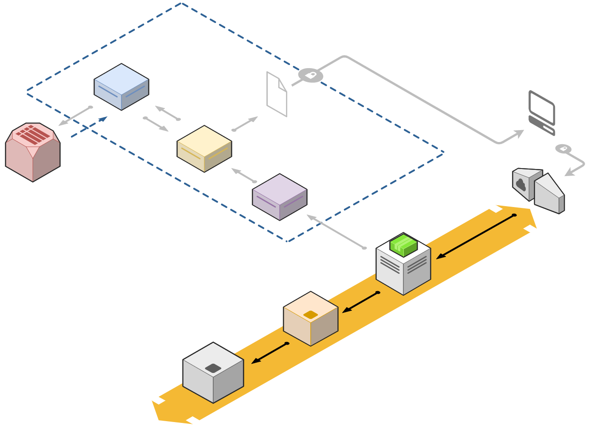
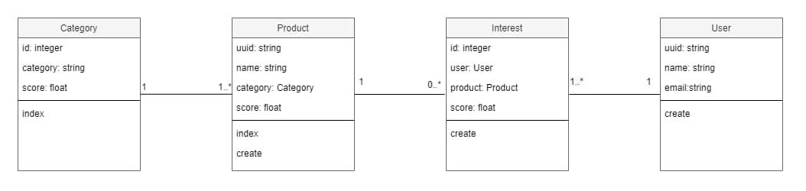

# [MyDataMood-survey](https://mydatamood-survey.herokuapp.com)
[](https://travis-ci.com/jupcan/mydatamood-survey) [](https://mydatamood-survey.herokuapp.com/)
> REST API to handle a survey system collecting user interests in certain products and categories and providing insights about the popularity of each of them to understand consumer trends and how they can monetize them.



## Usage
There are 4 different endpoints implemented:

**1. PUT /products** - loads the list of available products into the system and removes all previous data (products and interests). This method may be called more than once during the life cycle of the service. For each product we will store:
- **Id**: unique identifier of the product
- **Name**: name of the product
- **Category**: textual symbol representing the type of business a product is enclosed in (i.e. "car_insurances"...)

**Body**: The list of products to load  
**Content Type**: application/json

Sample Request:
```json
[
    {
        "id": "1234abcd",
        "name": "Car Insurance for any damage",
        "category": "car_insurances"
    },
    {
        "id": "5678efgh",
        "name": "Internet Cable Connection, up to 600Mb",
        "category": "landline_internet"
    }
]
```

**2. POST /interest** - serves as the main entry point for the results of the surveys, it will be used to load the interest shown by a user into a particular product, based on a score between 0 and 10. A user cannot score the same product twice.

**Body**: The Interest resource  
**Content Type**: application/json

Sample Request:
```json
{
    "user_id": "asdfasdf123",
    "product_id": "1234abcd",
    "score": 7
}
```

**3. GET /categories** - query category data. It receives three parameters:

- **q**: specifies the type of query to be run. For this exercise it only supports the value "score". It means we want the endpoint to return a list of categories, alongside their score, based on the mean of all the scores of all their products
- **limit**: the limit in the number of results returned
- **reverse**: boolean flag to indicate the result ordering, based on the score. If true, the order is from greater to smaller. Defaults to false.

```
/categories?q=score&limit=3&reverse=true
```
```json
[
    {
        "category": "landline_internet",
        "score": 8
    },
    {
        "category": "race_cars",
        "score": 7
    },
    {
        "category": "stock_investment",
        "score": 6.5
    }
]
```

**4. GET /productss** - query product data. It receives three parameters:

- **q**: specifies the type of query to be run. For this exercise it only supports the value "score". It means we want the endpoint to return a list of categories, alongside their score, based on the mean of all the scores of all their products
- **limit**: the limit in the number of results returned
- **reverse**: boolean flag to indicate the result ordering, based on the score. If true, the order is from greater to smaller. Defaults to false.

```
/products?q=score&limit=2
```
```json
[
    {
        "product": {
            "product_id": "asdf102938",
            "name": "Awesome Programming book",
            "category": "software_engineering"
        },
        "score": 8.5
    },
    {
        "product": {
            "product_id": "5678efgh",
            "name": "Internet Cable Connection, up to 600Mb",
            "category": "landline_internet"
        },
        "score": 9.3
    }
]
```

## Information
Some considerations regarding the development of the REST API.
- It is production ready, master branch automatically deploys to Heroku only if Travis CI is passed
- Tests developed using RSpec (TDD) and included in the CI enviroment 
- Documentation made with Swagger including UI to test all endpoints if desired 
- Class and architecture diagrams provided in /doc folder 
- Active Records errors are rescued generically due to time restrictions when developing the challenge, it will be better to control them for each object instance so as to know which one fails and do not stop whole execution


